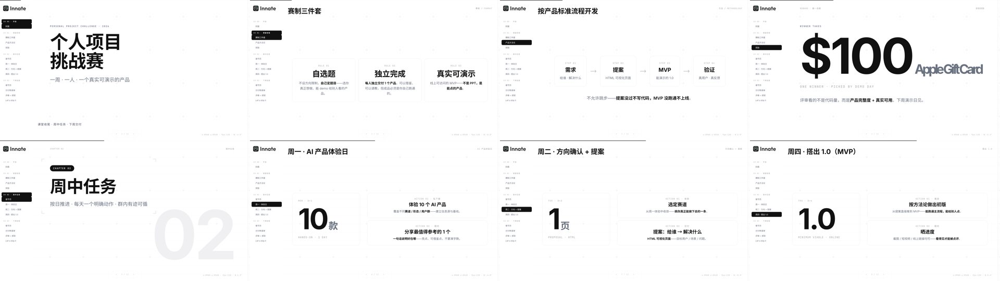

[English](README.md) | [简体中文](README.zh-CN.md)

# 个人项目挑战赛

一套 12 页中文任务说明课件，用于组织为期七天的个人产品挑战：一人、一个自选题、一个可在线演示的真实产品。

## 课件内容

课件覆盖：

- 挑战规则与产品开发标准
- AI 产品体验日
- 方向选择与产品提案
- 周中 MVP 检查
- 最终交付物、演示评审与奖励

成品是一个单文件 HTML 演示文稿，支持侧边栏目录、前后翻页按钮和键盘快捷键。

## 本地查看

可以直接用浏览器打开 课件/index.html，也可以在仓库根目录启动静态服务器：

    python3 -m http.server 4173

然后访问 http://127.0.0.1:4173/课件/。

可使用左右方向键、Page Up、Page Down 或页面按钮翻页。

## 源文件与再生成

- build.py：保存课件内容并组装最终页面
- 课件/index.html：已生成、可直接使用的演示文稿
- screenshot.py：逐页截图并生成联络表，用于视觉检查
- shots/：当前的课件检查图

当前 build.py 会从本机 Claude Code Skill 路径读取 coursedeck 模板。已生成的 HTML 可以独立使用，但如需重新生成，必须保证 build.py 中声明的本地模板路径可用。

重新生成截图还需要 Playwright、Pillow，以及 Playwright 的 Chromium 浏览器。

## 许可证

本课程材料采用[知识共享署名—非商业性使用 4.0 国际许可协议](LICENSE)。允许在署名的前提下为非商业目的分享和改编；不允许商业使用。

© 2026 realruian。
